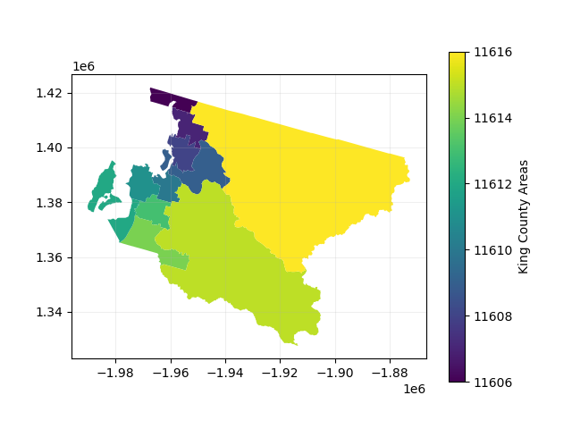
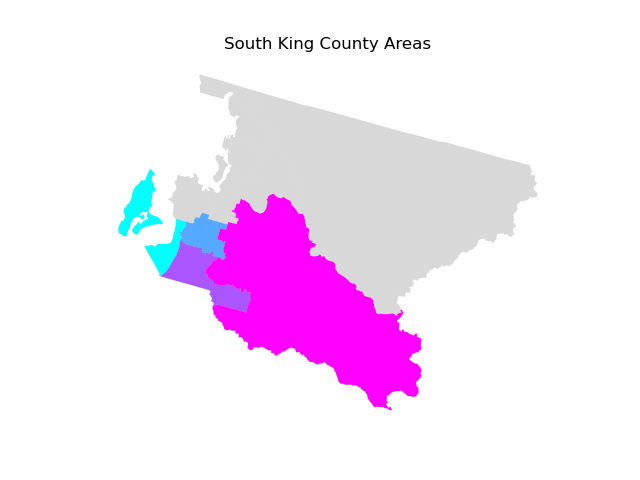
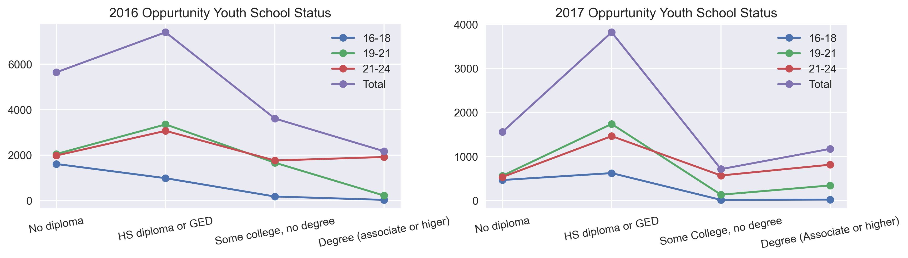
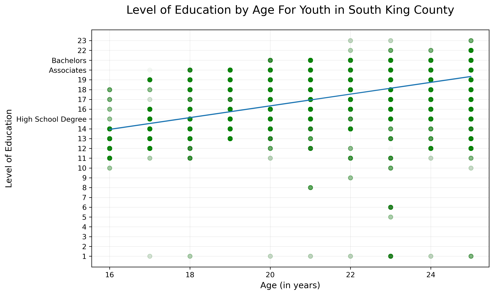
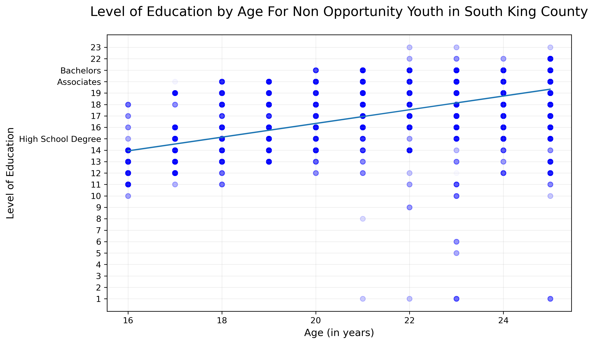
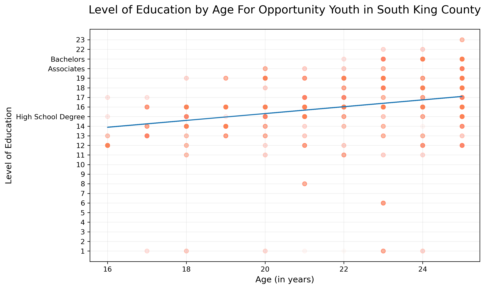

# South King County Opportunity Youth

This project offers an updated estimate of the number of Opportunity Youth in South King County using the 2017 5-year American Community Survey [(ACS)](https://www.census.gov/programs-surveys/acs/about.html) Public Use Microdata Survey [(PUMS)](https://www.census.gov/programs-surveys/acs/technical-documentation/pums.html).


## BACKGROUND

Measuring the successes and barriers faced by our most vulnerable youth is a challenge in the South King County region<sup>1</sup>. While there is a lot of information gathered from K12 districts and colleges about student outcomes, few data exists among Opportunity Youth (OY): young folks between the age 16 through 24 who are disengaged from both work and school<sup>2</sup>. This population is of particular interest to The Seattle Region Partnership (SRP), a multi-sector initiative founded by the Seattle Metropolitan Chamber of Commerce, Seattle Foundation, City of Seattle, and King County<sup>3</sup>.


## PROJECT GOAL

The SRP would like an update on the estimated number of OY in South King County. According to a recent The Seattle Times article, the number of OY in South King County has remained steadfast at 19,000<sup>4</sup>. However, that estimation comes from a report that is over three years old. As Data Science Consultants, your task is to inform the SRP on the current status of OY in South King County using updated data.


## TABLE OF CONTENTS

Our home repository contains the project environment and information about our project.

The notebooks folder contains two more folders- the report folder which houses an organized polished file containing the entire project, and an exploratory folder, which houses an exploration of the data we each individually took part in, which constituted our workflow. The notebook folder also contains readme files to further explain the contents.

The src folder contains all the data we needed to import for the project. It is organized by file types - sql, csv, and shapefiles.

The reports folder contains the pdf presentation of our project. It also has an figures folder in which we outputted all of our images.

the references folder contains any sources we used to aid our project.

Note: We could not include the shapefile as it was too large but here is a link on how to download it. https://usa.ipums.org/usa/volii/boundaries.shtml it is the very first download link labeled "2010 PUMAS"

## PROJECT

To get a better sense of the area we are analyzing, we have created a map of King County, WA. Each region in King county is highlighted in a different color below. We are using PUMA (Public Use Microdata area code) to specify each region.



Specifically we will be looking at South King County shown highlighted below



As we start analyzing the data, we filter out for the information we need. In our query we find all the puma regions where the state name is Washington and the county name contains "King" and "South". This way, we get the data for South King County in Washington. We are taking the Puma code, the name (County, city, location), housing unit, person in housing unit, age, education level, and employment status for the data we want to analyze. Each row in the data contains a certain weight of the population so we multiply the number of rows to take the unique weight of each row into consideration.

Once we have the data we need, it is time to start grouping the data. We group the data to opportunity youth status, level of education, and age. We add a column to count the total population of each age group. Now that our data is grouped the way we want it, it's time to move on to the next step - finding meaning in our data.

First we want to find the level of education completed by the Opportunity Youth. We create a pivot table with 3 age groups of oy "16-18", "19-21", "21-24", and the Total. Each row shows the level of education completed. We also create a pivot table showing how much of the population is opportunity youth in each age group and how much of the population is working without a diploma. We calculate the percents of the populations for each category to better understand the data.

Next, we want to compare this current data with the 2016 data and see if there are notable changes. We import a csv of the 2016 information to compare and place a side by side comparison in a chart.



Here we notice a difference in population. This is because the 2016 data included Renton City as a part of South King County, whereas we did not. Still, we can get a good comparison using our population sample. We can see a higher percentage of people achieved their GEDs/highschool diplomas, yet not many opportunity youth are able to pursue a higher level of education. In the following visualations we will explore the trends further in opportunity youth education.

First, we will display a chart for level of education by age for youth in South King County. We will put a line of best fit to find the rate at which the general youth in the area are completing their education.



Next we will display the same chart, but only with the demographic of none Opportunity Youths.



Lastly we will display the same chart, but only with the demographic of Opportunity Youths.



Looking at these charts we can conclude that Opportunity youths are only able to complete their education at half the rate of non Opportunity youths. This is troubling data. It brings to light the systemic barriars perventing the opportunity youths from achieving higher education, and many times even highschool degrees. This is clearly not an individual problem, but a sociological one. They problem lies within the system which needs to change for those in dire situations to be able to make a living in this world.


### Setup Instructions in case you would like to work in this repository

If you are missing required software (e.g. Anaconda, PostgreSQL), please run the following command in Bash (designed for Mac computers):
```bash
# installs necessary requirements
# note: this may take anywhere from 10-20 minutes
sh src/requirements/install.sh
```

For Windows and Linux computers, you may need to manually ensure that you have installed [Anaconda](https://docs.anaconda.com/anaconda/install/) and [PostgreSQL](https://www.enterprisedb.com/downloads/postgres-postgresql-downloads).

### `oy-env` conda Environment

This project relies on you using the [`environment.yml`](environment.yml) file to recreate the `oy-env` conda environment. To do so, please run the following commands *in your terminal*:

```bash
# create the oy-env conda environment
conda env create -f environment.yml

# activate the oy-env conda environment
conda activate oy-env

# if needed, make oy-env available to you as a kernel in jupyter
python -m ipykernel install --user --name oy-env --display-name "Python 3 (oy-env)"
```

Note that this may take 10 or more minutes depending on internet speed.

**Windows Note:** The same versions of these packages are not available for Windows computers, so all Windows users should use the `windows.yml` file instead of `environment.yml` (this file was generated on Windows 10)

**Linux Note:** The same versions of these packages are not available for Linux computers, so all Linux users should use the `linux.yml` file instead of `environment.yml` (this file was generated on Red Hat)

**Catalina Note:** You may need to modify the `prefix` at the very bottom of `environment.yml` if you are on macOS Catalina.  Run `conda env list` in your terminal to determine the appropriate path by looking at the paths of your existing conda environment(s).  Modify `environment.yml` then try running the installation commands listed above again.

On all operating systems, you will know that you have the required software if the following Bash commands do not return error or "not found" messages:
```bash
which conda
conda list geopandas
which psql
```

### Data Download

To download the relevant data, run the following command *in Python*:

```
data_collection.download_data_and_load_into_sql()
```

Note that this may take 10 or more minutes depending on internet speed.

There is an example notebook in the `notebooks/exploratory` directory with this code already added.

## Citations

<sup>1</sup> Yohalem, N., Cooley, S. 2016. “Opportunity Youth in the Road Map Project Region”. Community Center for Education Results. Available at: https://bit.ly/2P2XRF3.

<sup>2</sup> Anderson, T., Braga, B., Derrick-Mills, T., Dodkowitz, A., Peters, E., Runes, C., and Winkler, M. 2019. “New Insights into the Back on Track Model’s Effects on Opportunity Youth Outcomes”. Urban Institute. Available at: https://bit.ly/2BuCLr1.

<sup>3</sup> Seattle Region Partnership. 2016. “King County Opportunity Youth Overview: Demographics of opportunity youth and systemic barriers to employment”. Available at: https://bit.ly/2oRGz37.

<sup>4</sup> Morton, N. 2019. “Nearly 19,000 youth in King County are neither working nor in school. How one Seattle nonprofit is changing that.” The Seattle Times. Available at: https://bit.ly/2W5EufR.
